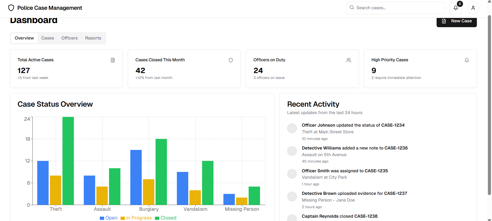
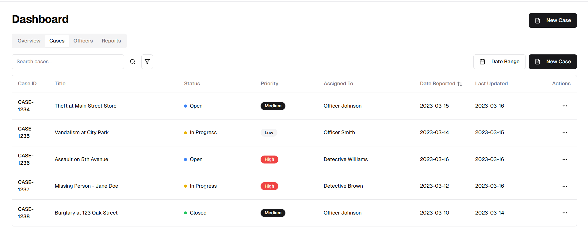

# Specification and other stuff for this feature / design doc

The dashboard feature will have a main skeleton - then have sub page routes.

NOTE:

- Design the skeleton to be a shell that renders sub route contents as sub page using angular parent and sub child page components
- Design the clickable url links to switch between sub pages to be configurable with roles, so you have a list of clickable links and roles
  that should be able to see it.
- The below designs are helpers i wont make it exact but take ideas from them
  For example:

```js
const dashboardClickableLinks = [
  {
    name: "overview",
    authorizedRoles: ["Admin", "Operations"],
    href: "/dashboard/overview", // where it would take the user when clicked
  },
];
```

Main dashboard skeleton:

- Contains the header
- Contains the clickable links - and or hide them
- Then render the sub pages below it in a container

Then render each one and match them against current user roles, they have to have at least one of the roles to see the link

## Overview page



## Cases page


