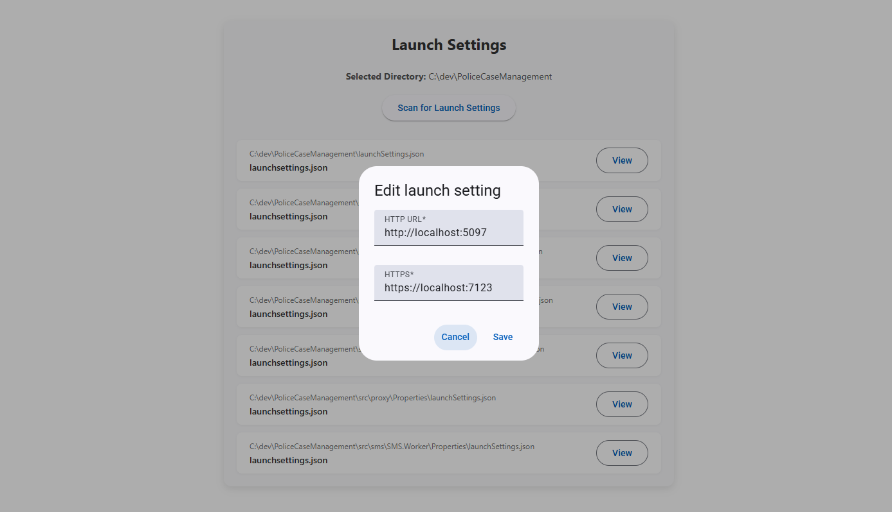

# Configy 

Current features

- allows project wide launchsettings.json urls to be changed and other files that refer to the url will be changed 

# Running 

- Do not change `.env.example` copy it and renaming it to `.env` this is the one you change
- Inside `.env` there is `NODE_ENV` make it `development`
- in render run `npm start`
- in root run `npm start`

# Build prod

- change `.env` to be prod 
- in root of configy run `node scripts/build.js`
- this will output a dist folder for now only windows dist - dose all steps for manual - https://www.electronjs.org/docs/latest/tutorial/application-distribution
- cd into disc and run `electron.exe` to run the final prod version of the app

# Style guide

- Keep all electron js files in electron folder
- keep all ui frontnend angular code in render