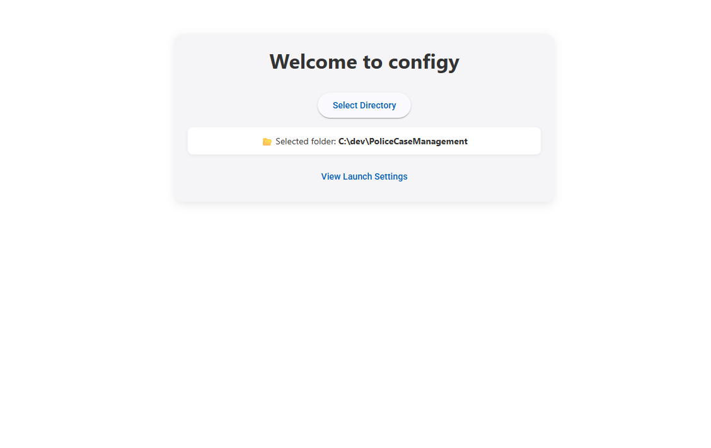

# Configy 

Current features

- allows project wide launchsettings.json urls to be changed and other files that refer to the url will be changed 

# Running 

- in render run `npm start`
- in root run `npm start`
- `.env` make it `development`

# Build prod

- change `.env` to be prod 
- in root of configy run `node scripts/build.js`
- this will output a dist folder for now only windows dist
- cd into disc and run `electron.exe` to run the final prod version of the app